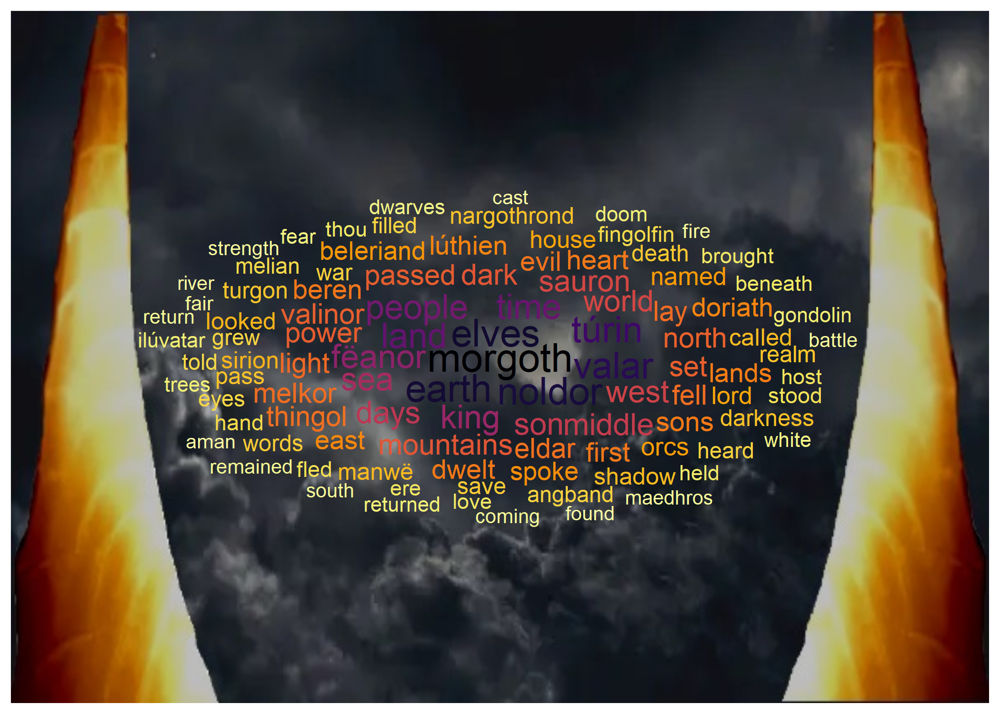
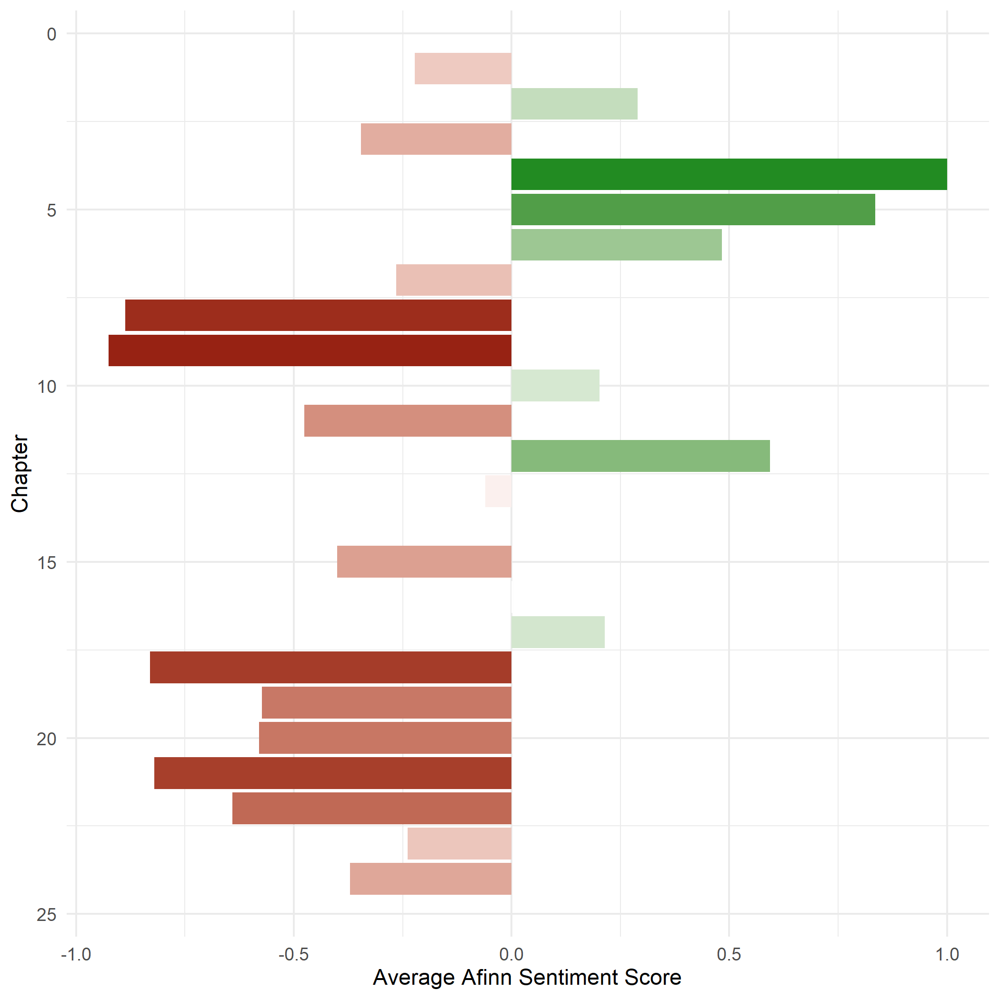

```{r setup, include=FALSE}
knitr::opts_chunk$set(echo = FALSE)
```

## Overview

```{r eval = FALSE}
# Libraries
# --- General functionality
library(tidyverse)
library(here)
# --- Text manipulation
library(tidytext)
library(pdftools)
library(textdata)
# --- Building plots
library(ggwordcloud)
library(pacman)
library(grid)
library(viridis)
```

Through various text wrangling packages, we will break down common word usage and sentiments from JRR Tolkien's The Silmarillion.

>“...if joyful is the fountain that rises in the sun, its springs are in the wells of sorrow unfathomed at the foundations of the Earth.”

Tolkien, J.R.R. The Silmarillion. New York: Houghton Mifflin Company, 2001. EPub. Internet Archive. Retrieved February 21, 2021, from https://archive.org/details/TheSimmarillon

## Text wrangling and Analysis
```{r eval = FALSE}
# Read in source pdf
silmarillion_text <- pdf_text(here("data", "SilmarillionThe-J.R.R.TolkienChristopherTolkienTedNasmith.pdf"))

# Create data frame and begin to parse it down
silmarillion_tidy <- data.frame(silmarillion_text) %>% 
  mutate(text_full = str_split(silmarillion_text, pattern = "\\n")) %>% 
  unnest(text_full) %>% 
  mutate(text_full = str_trim(text_full))

# Slice the relevant section of text (all chapters) and derive chapter numbers 
silmarillion_df <- silmarillion_tidy %>% 
  slice(827:13101) %>%
  mutate(chapter = case_when(
    str_detect(text_full, pattern = "Chapter") ~ text_full,
    TRUE ~ NA_character_
  )) %>% 
  fill(chapter) %>% 
  separate(col = chapter, into = c("ch", "no", sep = " ")) %>% 
  mutate(chapter = as.numeric(no))

# Final parse into individual tokens/words
silmarillion_tokens <- silmarillion_df %>% 
  unnest_tokens(word, text_full) %>% 
  dplyr::select(chapter, word)

# Remove stop words
silmarillion_trimmed <- silmarillion_tokens %>% 
  anti_join(stop_words)

# Since the source has poorly recognized special characters, some words have become fragmented in our token unnest
# we can transform some of the more common ones back to their original
clipped_words <- c("rin", "anor", "thien", "manw", "vatar", "rendil", "menor")
transformed_words <- c("túrin", "fëanor", "lúthien", "manwë", "ilúvatar", "eärendil", "númenor")

silmarillion_corrected <- silmarillion_trimmed %>% 
  mutate(word = case_when(
    word %in% clipped_words ~ transformed_words[match(word, clipped_words)],
    str_detect(word, "fi") ~ str_replace(word, "fi", "fi"),
    str_detect(word, "fl") ~ str_replace(word, "fl", "fl"),
    str_detect(word, "ff") ~ str_replace(word, "ff", "ff"),
    TRUE ~ word
  )) %>% 
  filter(word != "il") # another relic of weird parsing, its compliment gets replaced above

# Calculate word counts and sort
word_counts <- silmarillion_corrected %>% count(word) %>% arrange(desc(n))

# Construction of Barad-dûr
tower <- jpeg::readJPEG(here("data", "tower2.jpg"))
word_counts %>% 
  slice(1:100) %>% 
  ggplot(aes(label=word)) +
  annotation_custom(rasterGrob(tower, 
                               width = unit(1,"npc"), 
                               height = unit(1,"npc")), 
                               -Inf, Inf, -Inf, Inf) +
  geom_text_wordcloud(aes(color = n, size = n)) +
  scale_size_area(max_size = 7) +
  scale_color_viridis(option = "inferno", direction = -1)
```




Figure 1: Word cloud of the one hundred most frequently occurring words throughout all chapters of The Silmarillion.

---

```{r eval = FALSE}
# Sentiment analysis with afinn lexicon
silmarillion_afinn <- silmarillion_corrected %>% 
  inner_join(get_sentiments("afinn"))

# Calculate mean afinn value per chapter
afinn_means <- silmarillion_afinn %>% 
  group_by(chapter) %>% 
  summarise(mean_afinn = mean(value))

# Build plot
ggplot(data = afinn_means, aes(x = chapter, y = mean_afinn, fill = mean_afinn)) +
  geom_col() +
  coord_flip() +
  theme_minimal() +
  scale_fill_gradient2(low = "darkred", mid = "white", high = "forestgreen") +
  scale_x_continuous(trans = "reverse") +
  theme(legend.position = "none") +
  labs(x = "Chapter", y = "Average Afinn Sentiment Score")
``` 




Figure 2: Sentiment analysis giving a per chapter score of The Silmarillion using the AFINN sentiment lexicon.

