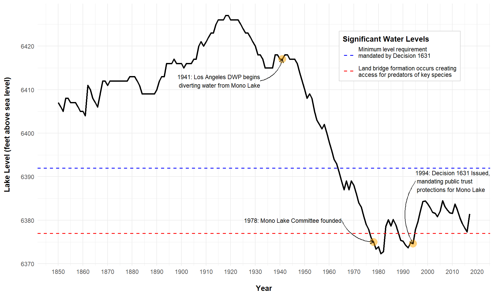

```{r setup, include=FALSE}
knitr::opts_chunk$set(echo = TRUE)
```

```{r eval = FALSE}
# Packages used
library(tidyverse)
library(here)
library(janitor)

# Read in and tidy the data from data/mono_lake_annual_levels.csv
annual_lake_levels <- read_csv(here("data", "mono_lake_annual_levels.csv"), skip = 5, col_names = TRUE) %>% 
  clean_names() %>% 
  rename(lake_level = lake_level_feet_above_sea_level) %>% 
  select(year, lake_level)

# *insert beautiful plot here*
ggplot(data = annual_lake_levels, aes(x = year, y = lake_level)) +
  geom_line(size = 1) +
  # Horizontal line indicating Decision 1631 water level
  geom_hline(aes(yintercept = 6392, color = "blue"), size = .7, linetype = "dashed") +
  # Horizontal line indicating land bridge formation
  geom_hline(aes(yintercept = 6377, color = "red"), size = .7, linetype = "dashed") +
  # Annotation for 1941 DWP Diversions Begin
  annotate(geom="point", x = 1941, y = 6417, size = 5, color = "orange", alpha = 0.5) +
  annotate(
    geom = "curve", x = 1932, y = 6412, xend = 1941, yend = 6417, 
    curvature = .3, arrow = arrow(length = unit(2, "mm"))
  ) +
  annotate(geom="text", x = 1932, y = 6412, label="1941: Los Angeles DWP begins\ndiverting water from Mono Lake", size = 3, hjust = "right") +
  # Annotation for 1978 Mono Lake Committee founded
  annotate(geom="point", x = 1978, y = 6375, size = 5, color = "orange", alpha = 0.5) +
  annotate(
    geom = "curve", x = 1965, y = 6380, xend = 1978, yend = 6375, 
    curvature = .3, arrow = arrow(length = unit(2, "mm"))
  ) +
  annotate(geom="text", x = 1965, y = 6380, label="1978: Mono Lake Committee founded", size = 3, hjust = "right") +
  # Annotation for 1994 Decision 1631
  annotate(geom="point", x = 1994, y = 6374.6, size = 5, color = "orange", alpha = 0.5) +
  annotate(
    geom = "curve", x = 1995, y = 6389, xend = 1994, yend = 6374.6, 
    curvature = .3, arrow = arrow(length = unit(2, "mm"))
  ) +
  annotate(geom="text", x = 1995, y = 6389, label="1994: Decision 1631 Issued,\n mandating public trust\n protections for Mono Lake", size = 3, hjust = "left") +
  # Horizontal line legend
  scale_color_manual(
    name = "Significant Water Levels",
    values = c("blue","red"),
    labels = c("Minimum level requirement\nmandated by Decision 1631\n","Land bridge formation occurs creating\naccess for predators of key species")
  ) +
  # Axis labels
  scale_x_continuous(breaks = seq(1850,2020, 10)) +
  labs(
    x = "\nYear",
    y = "Lake Level (feet above sea level)\n"
  ) +
  # Theme and styles
  theme_minimal() +
  theme(
    axis.title = element_text(face = "bold"),
    legend.position = c(0.8,0.8),
    legend.title = element_text(face = "bold"),
    legend.background = element_rect(
      fill="white",
      size=0.5, linetype="solid", 
      colour ="lightgrey"
    )
  )

```



**Figure 1:** Historical changes in water level of Mono Lake, Lee Vining, California (1850-2017)
