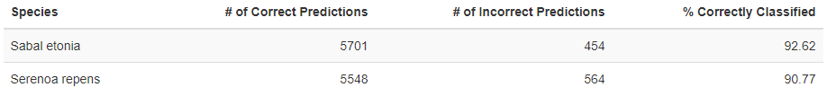

```{r setup, include=FALSE}
knitr::opts_chunk$set(echo = TRUE)
```

## Overview

In this document, we will use binary logistic regression to infer a model for the probability of a plant in our dataset being Serenoa repens or Sabal etonia. Observations of these south-central Florida palmetto species include plant height, canopy length, canopy width, and green leaves, which are each provided in the data and subsequently used as predictor variables^1^.

## Exploratory Data Visualization

```{r eval = FALSE}
# Packages used
library(tidyverse)
library(here)
library(GGally)
library(broom)
library(jtools)
library(patchwork)
library(kableExtra)

# Read in data from csv
palmetto <- read_csv(here("data/palmetto.csv"), col_types = cols(.default = "c"))

# Refine data to desired subset and proper column types
palmetto_target <- palmetto %>% select(species, height, length, width, green_lvs) %>% 
  mutate(height = as.numeric(height)) %>% 
  mutate(length = as.numeric(length)) %>% 
  mutate(width = as.numeric(width)) %>% 
  mutate(green_lvs = as.numeric(green_lvs)) %>% 
  mutate(species = case_when(
    species == 1 ~ "Serenoa repens",
    species == 2 ~ "Sabal etonia"
  )) %>% 
  mutate(species = as.factor(species))

# Visualization comparing plant attributes between species
width_plot <- palmetto_target %>% drop_na() %>% 
  ggplot(aes(x = species, y = width, fill = species)) +
  geom_boxplot() +
  labs(x = "", y = "", title = "Canopy Width (cm)") +
  scale_fill_manual(values = c("chartreuse3", "mediumaquamarine"))

length_plot <- palmetto_target %>% drop_na() %>% 
  ggplot(aes(x = species, y = length, fill = species)) +
  geom_boxplot() +
  labs(x = "", y = "", title = "Canopy Length (cm)") +
  scale_fill_manual(values = c("chartreuse3", "mediumaquamarine"))

height_plot <- palmetto_target %>% drop_na() %>% 
  ggplot(aes(x = species, y = height, fill = species)) +
  geom_boxplot() +
  labs(x = "", y = "", title = "Plant Height (cm)") +
  scale_fill_manual(values = c("chartreuse3", "mediumaquamarine"))

(width_plot + length_plot + height_plot) &
  theme_grey() +
  theme(legend.position = "none", axis.text = element_text(size = 8))
```


Figure 1: Comparing the quartile distributions of canopy width, canopy length, and plant height (each in centimeters) of the two palmetto species Sabal etonia and Serenoa repens.

Canopy width and plant height appear to be very similarly distributed between the species, and canopy length only slightly less so, indicating that these particular variables may be less significant than others for informing our logistic model.

---

```{r eval = FALSE}
# Comparing number of green leaves between species
palmetto_target %>% drop_na() %>%
  ggplot(aes(x = species, y = green_lvs, color = species)) +
  geom_jitter() +
  scale_color_manual(values = c("chartreuse3", "mediumaquamarine")) +
  labs(y = "Number of Green Leaves\n", x = "") +
  theme_grey() +
  theme(legend.position = "none")
```


Figure 2: Comparing all observations of the number of green leaves recorded for each species.

In general, the number of green leaves counted for Serenoa repens specimens is higher than that of Sabal etonia; a contrast that could indicate that the number of green leaves become a heavily influencing factor in our model compared to other variables.


## Binomial Logistic Regression


```{r eval = FALSE}
# levels(palmetto_target$species)
# "Sabal etonia"   "Serenoa repens"
# model will output odds of species being "Serenoa repens"

# Perform Binary Logistic Regression for species odds
# using variables: height, length, width, green_lvs
palmetto_blr <- glm(species ~ height + length + width + green_lvs, data = palmetto_target, family = "binomial")

# look at outcomes

# summary(palmetto_blr)
blr_table <- palmetto_blr %>% tidy() %>% 
  mutate(p.value = case_when(
    p.value < 0.001 ~ "< 0.001"
  ))

# output formatted table
blr_table %>%
  kbl(caption = "Table 1: Results of binary logistic regression for predicting species.") %>%
  kable_styling(bootstrap_options = "striped", full_width = T)
```


```{r eval = FALSE}
# Apply model to determine fitted predictions for our data
blr_fitted <- palmetto_blr %>% 
  augment(type.predict = "response")

# Mutate to determine correctness of each fit based on 50% threshold         
blr_prediction <- blr_fitted %>%
  mutate(predicted = case_when(
    .fitted >= 0.5 ~ "Serenoa repens",
    .fitted < 0.5 ~ "Sabal etonia"
  )) %>% 
  mutate(correct = case_when(
    species == predicted ~ "correct",
    species != predicted ~ "incorrect"
  ))

# Summarize correct/incorrect counts for each species into table
species_model_correctness <- blr_prediction %>% 
  group_by(species, correct) %>% 
  summarize(count = n()) %>% 
  pivot_wider(names_from = correct, values_from = count) %>% 
  mutate(pct_correct = round((correct/(correct+incorrect) * 100), 2))

colnames(species_model_correctness) <- c("Species", "# of Correct Predictions", "# of Incorrect Predictions", "% Correctly Classified")

species_model_correctness %>%
  kbl(caption = "Table 2: Outcomes of plant predictions based on our model using a 50% cutoff for classification under either level.") %>%
  kable_styling(bootstrap_options = "striped", full_width = T)
```




## Data Sources
^1^Abrahamson, W.G. 2019. Survival, growth and biomass estimates of two dominant palmetto species of south-central Florida from 1981 - 2017, ongoing at 5-year intervals ver 1. Environmental Data Initiative. https://doi.org/10.6073/pasta/f2f96ec76fbbd4b9db431c79a770c4d5 


