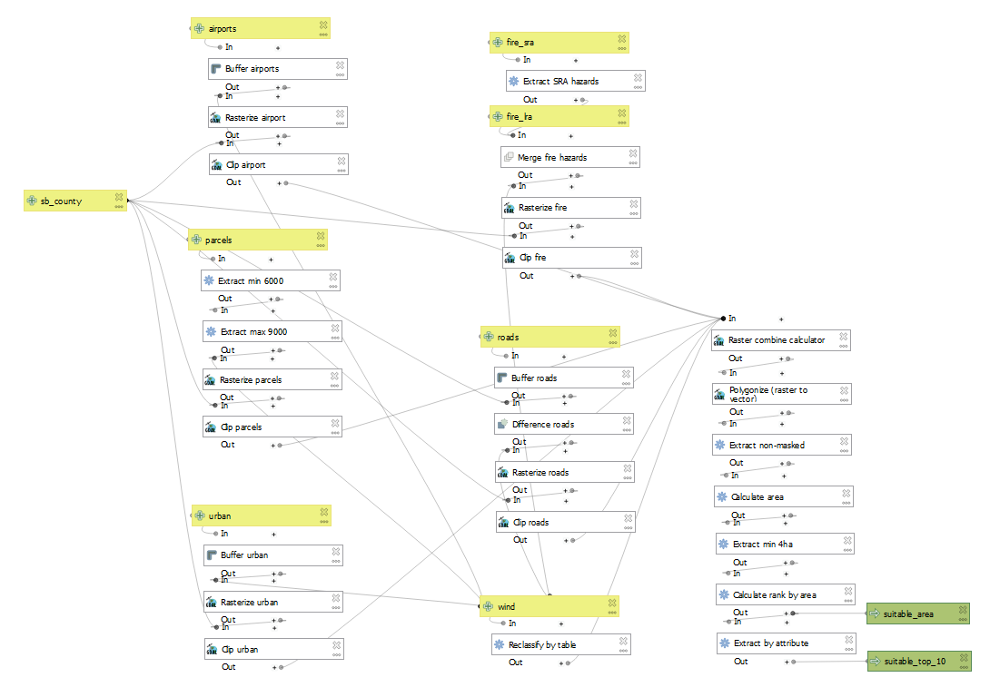
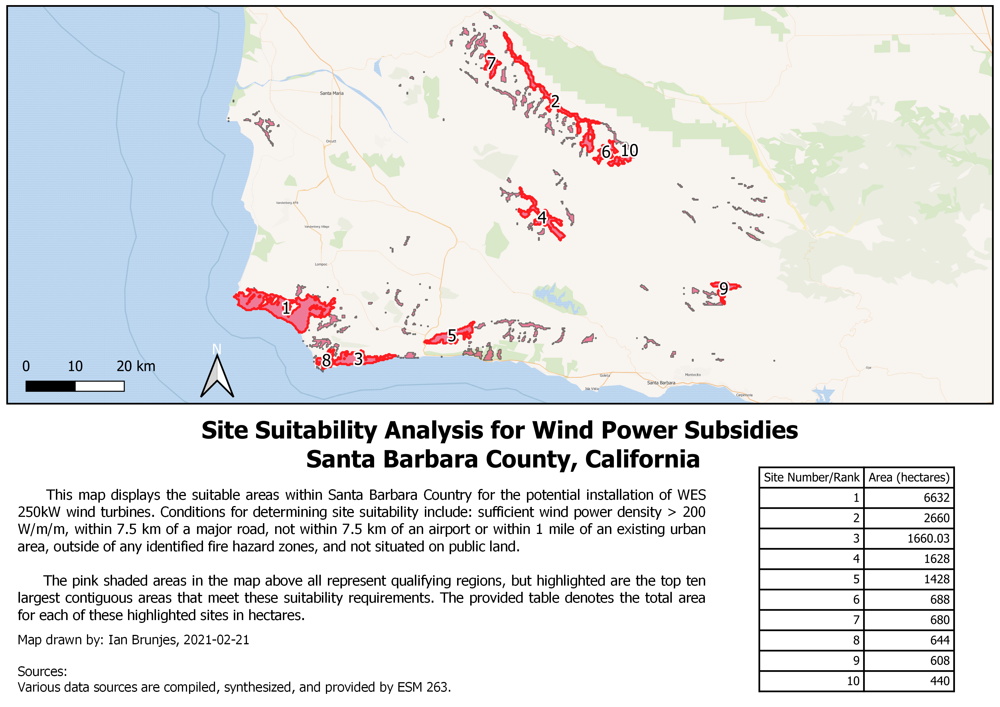

```{r setup, include=FALSE}
knitr::opts_chunk$set(echo = FALSE)
```

## Overview

Spatial data including information on wind speed, fire vulnerability, and proximity to roads, airports, public land, and urban development was used to infer regions of Santa Barbara County that would be suitable for hosting a wind power site based on criteria for these factors.

The model synthesizes these inputs to create a mask of suitable areas, whose size is calculated and ranked.

## Model



## Results



